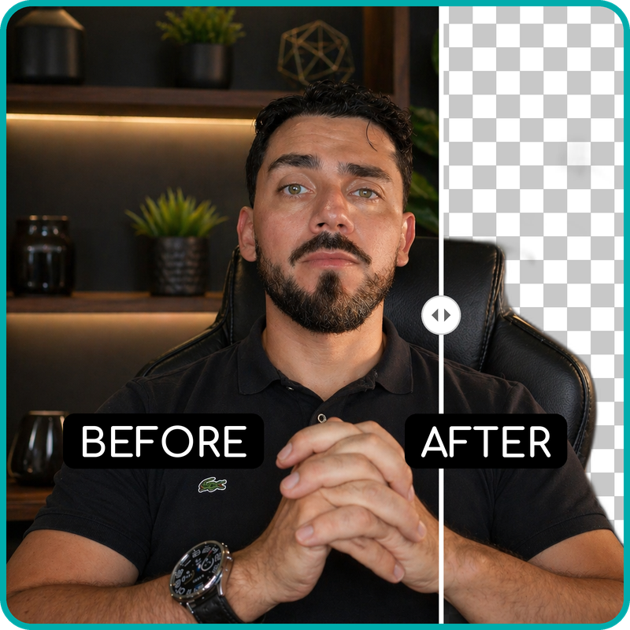

# remove-bg 🔥

A lightweight, developer-first CLI to remove backgrounds and optimize images with zero friction.
Process batches, auto-select strategies, compress intelligently — all locally, fast, and free.

<p align="center">
  
</p>

<p align="center">
  
  
  
</p>

---

## 📑 Table of Contents

- [✨ Features](#-features)
- [📁 Project Structure](#-project-structure)
- [🚀 How It Works](#-how-it-works)
- [🧰 Requirements](#-requirements)
- [📦 Installation](#-installation)
- [▶️ Usage](#️-usage)
- [🗜️ Image Compression](#️-image-compression)
- [🧪 Supported Formats](#-supported-formats)
- [🛠️ Tech Stack](#️-tech-stack)
- [📄 License](#-license)

---

## ✨ Features

- 🧠 **Automatic strategy selection** (default)
- 🤖 AI-based background removal (rembg)
- 🎨 Fast color-based removal for solid backgrounds
- 📂 Automatic folder organization by date
- 🧼 Input folder is cleaned after processing
- 🖥️ Verbose and friendly terminal output with emojis
- 📦 Managed with Poetry

---

## 📁 Project Structure

```text
remove-bg/
├── app/
│   ├── fs.py
│   ├── processor.py
│   ├── main.py
│   └── __init__.py
├── images/                 # Drop images here
├── originals/
│   └── YYYY-MM-DD/         # Archived original images
├── no-bg/
│   └── YYYY-MM-DD/         # Processed images (no background)
├── pyproject.toml
└── README.md
````

---

## 🚀 How It Works

1. Place images inside the `app/images/` folder
2. Run the command
3. The tool will:

   * Decide the best strategy automatically (**AUTO mode**)
   * Or use a forced strategy if specified
   * Move original images to `originals/<date>/`
   * Save background-removed images to `no-bg/<date>/`
   * Keep the `images/` folder clean

---

## 🧰 Requirements

* Python **3.13+**
* Poetry **2.x**
* Linux / macOS (Windows should work but is not the main target)

---

## 📦 Installation

```bash
git clone https://github.com/andersonlimacrv/remove-bg.git
cd remove-bg
poetry install
```

---

## ▶️ Usage

### 🔹 Automatic mode (default)

Uses a heuristic to choose the best strategy:

* Solid / mostly white background → 🎨 **COLOR**
* Complex background → 🤖 **AI**

```bash
poetry run rmbg
```

---

### 🔹 Force AI strategy

Recommended for people, products and complex images.

```bash
poetry run rmbg --type ai
```

---

### 🔹 Force color-based strategy

Recommended for logos, icons and solid backgrounds.

```bash
poetry run rmbg --type color
```

---

### 🔹 Force specific background color
```bash
poetry run rmbg --type color --color white
poetry run rmbg --type color --color "#f5f5f5"
```

### 🔹 Adjust color tolerance
```bash
poetry run rmbg --type color --tolerance 25
```

##  AUTO Strategy Explained

In AUTO mode, the tool :

1. Samples pixels from the image
2. Detects if the background is mostly white
3. Chooses:

   * 🎨 COLOR strategy for solid backgrounds
   * 🤖 AI strategy for complex backgrounds

This improves performance and avoids unnecessary AI processing.

## 🧠 AUTO Mode Logic

```yaml
AUTO:
 ├─ Solid / bright background?
 │   ├─ Yes → Detect color → COLOR
 │   └─ No  → AI (rembg)
```

---

## 🧪 Supported Formats

* PNG
* JPG / JPEG
* WEBP

---

## 🗜️ Image Compression

The `remove-bg` tool now includes an image compression module, providing smart compression and analysis without heavy dependencies.

### 🔹 Analyze Images (anlz-cmpss)

Analyze images in the `images/` folder to get compression suggestions without modifying any files. This is great for checking which strategy will be best, especially for AI-generated images.

```bash
poetry run anlz-cmpss
```

**Example Output:**
```text
🔍 avatar.png
- No transparency
- Medium complexity
→ Suggest: WEBP (quality=80)
→ Expected reduction: ~60-80%
Trade-offs:
- Slight loss in sharp edges possible
- Much smaller size
```

### 🔹 Compress Images (cmpss)

Compress images using the suggested strategies or force a specific format.

```bash
# Auto mode (chooses best format based on heuristics)
poetry run cmpss

# Force keeping the original format (no conversion)
poetry run cmpss --keep-format

# Force conversion to a specific format
poetry run cmpss --format webp

# Adjust quality (lossy formats)
poetry run cmpss --quality 75

# Force lossless compression
poetry run cmpss --lossless
```

**Format Conversion Priority:**
1. `--keep-format`: ALWAYS preserves the original extension.
2. `--format X`: Forces conversion to format X.
3. No arguments: Automatically decides based on heuristics.

**Note:** Files smaller than 50KB are automatically skipped to avoid unnecessary quality loss or size increases.

### 🔹 Format Avatars (fmt-avt)

Guarantees the image is formatted and compressed to fit under a specific size limit (default 1MB) and resizes it to a standard maximum dimension (1024px). Ideal for standardizing user avatars.

```bash
# Format to standard avatar size (< 1MB)
poetry run fmt-avt

# Set a custom max size (e.g., 500KB)
poetry run fmt-avt --max-size 500

# Force keeping the original format (prevents conversion to WebP)
poetry run fmt-avt --keep-format
```

---

## 🛠️ Tech Stack


---

## 📄 License

MIT License — free for personal and commercial use.

